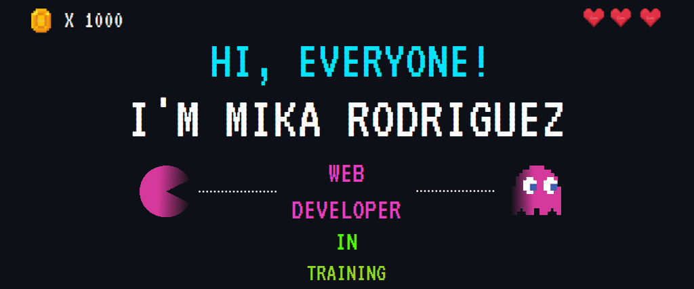

<h1 align = "center">  </h1>
<h3> About me:</h3>

+ 🏫 Undergrad student in IT
+ 📝 AZ-900 cert holder, thanks to [Innovacción Virtual](https://github.com/innovaccion-virtual)
+ ✨ Explorer (web-dev student) at [Innovacción Launch X](https://github.com/LaunchX-InnovaccionVirtual)
+ 💜 Love to learn. Currently I'm learning about: UI/UX Design, HTML, CSS, Javascript  
+ 🔥 My professional goal is to work as a web developer  
+ 🌎 Open to relocate for a job (via remote interviews). Also open to remote work    

<h3> Personal about me:</h3>

+ 🏞️ Other interests:  
  + Architecture & design, urban development, sustainability, economy, health sciences, education  
+ 🏡 In my free time I like to play videogames, design tiny houses, watch anime, ride my bike or read  
+ ⚧️ &nbsp; I am trans! (female to non-binary). My prononuns are: he/him   <!--My gender expression is masculine, but it may change.-->
+ 👨‍🏫 Have been through a lot and hope to become an inspiration for young people to overcome adversity  
